# OpenAnt — Complete Workflow & Architecture Analysis

## 1. Overview

OpenAnt is an open-source LLM-based vulnerability discovery tool by Knostic. Its unique **two-stage** approach — detection then attacker-simulation verification — minimizes both false positives and false negatives.

**Supported Languages**: Go, Python, JavaScript/TypeScript, C/C++, PHP, Ruby, Zig  
**Architecture**: Go CLI + Python Core + Multi-language Parsers  
**License**: Apache 2.0

---

## 2. Global Project Architecture

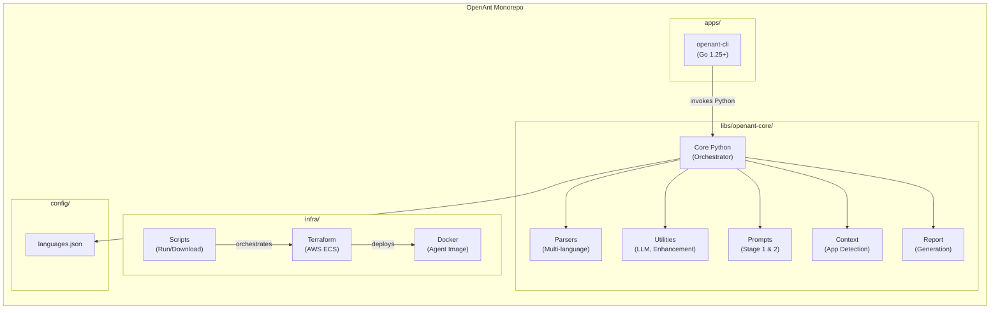

---

## 3. Main Pipeline (8 Steps)

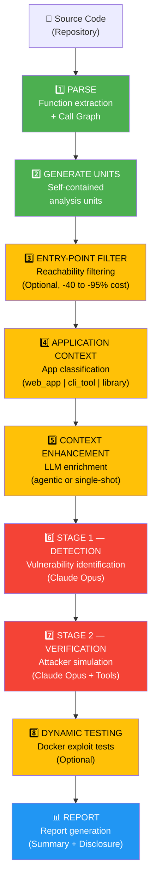

**Legend**: 🟢 Required | 🟡 Optional | 🔴 Critical LLM steps | 🔵 Output

---

## 4. Stage 1 vs Stage 2 Detail

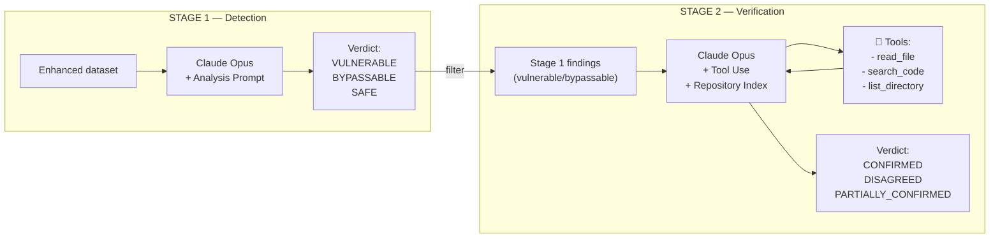

---

## 5. Parser Architecture

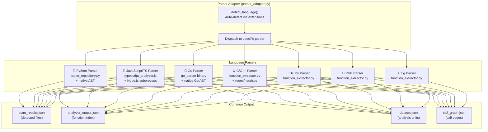

---

## 6. Parser Workflow (Python Example)

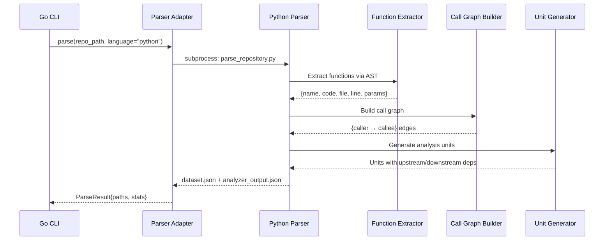

---

## 7. Agentic Enhancement Flow

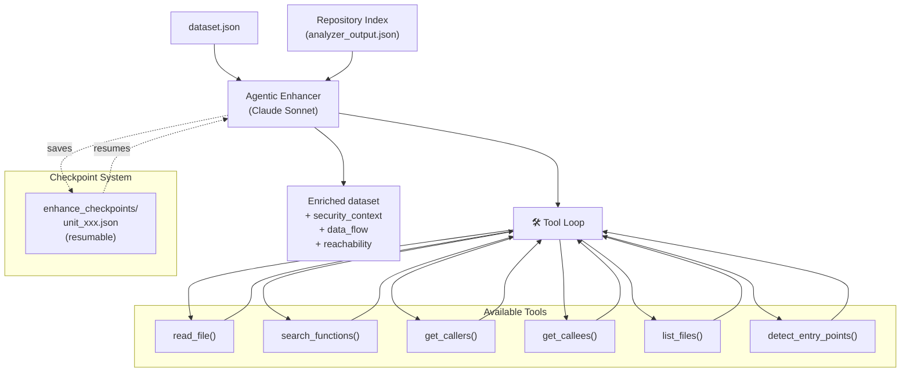

---

## 8. Checkpoint System (Resilience)

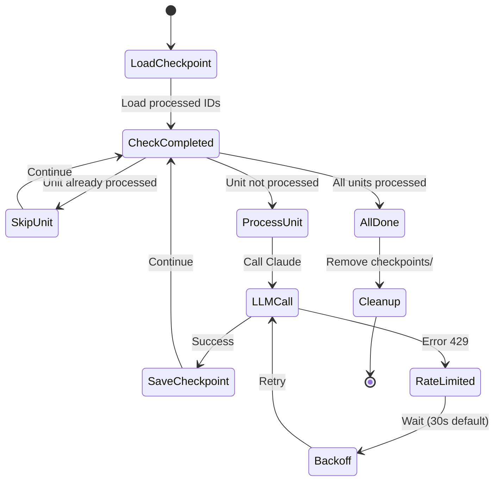

---

## 9. AWS Infrastructure (ECS Fargate)

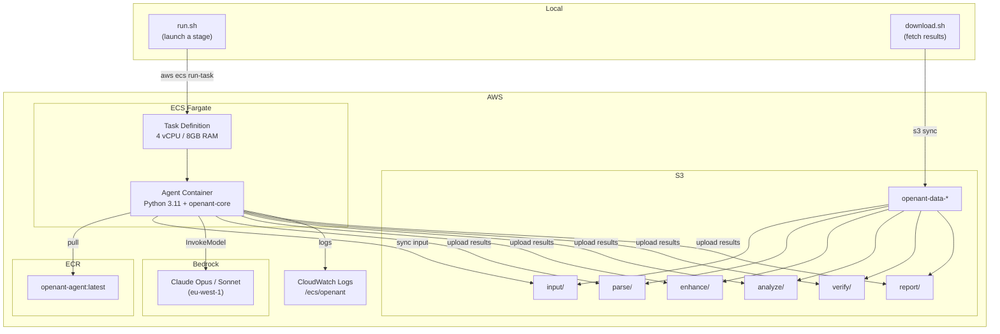

---

## 10. S3 Structure per Project

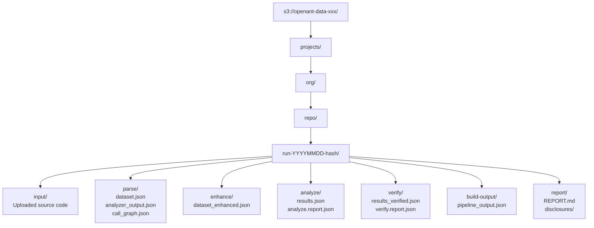

---

## 11. CI/CD (GitHub Actions)

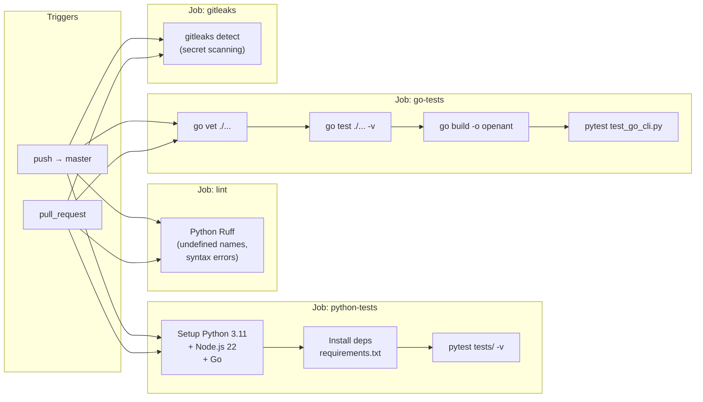

**OS Matrix**: ubuntu-latest, macos-latest, windows-latest

---

## 12. Complete Data Flow (End-to-End)

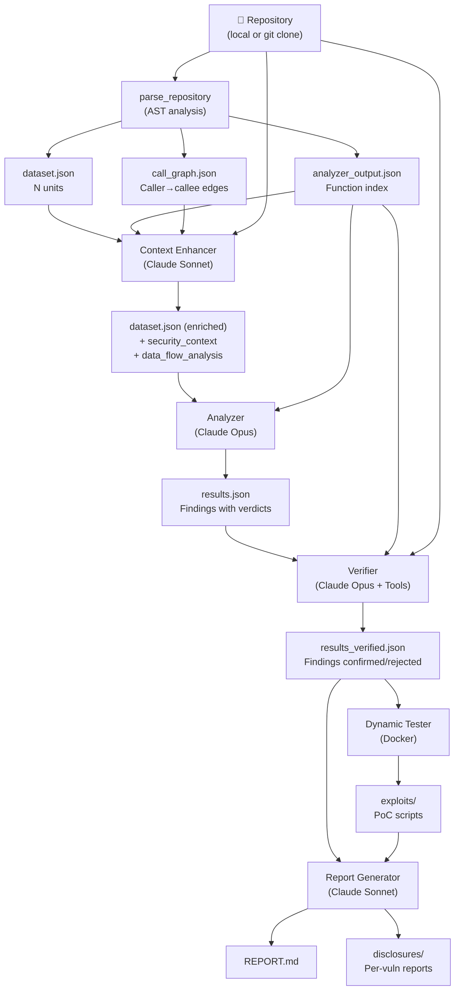

---

## 13. Cost Distribution

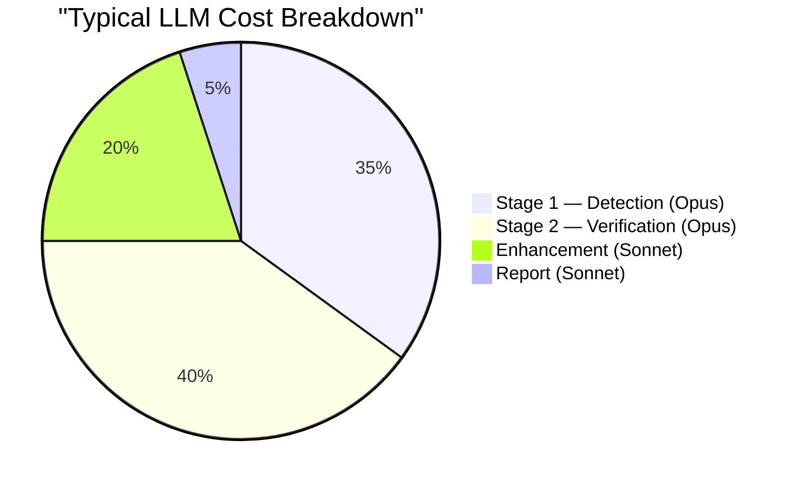

---

## 14. LLM Backend Management

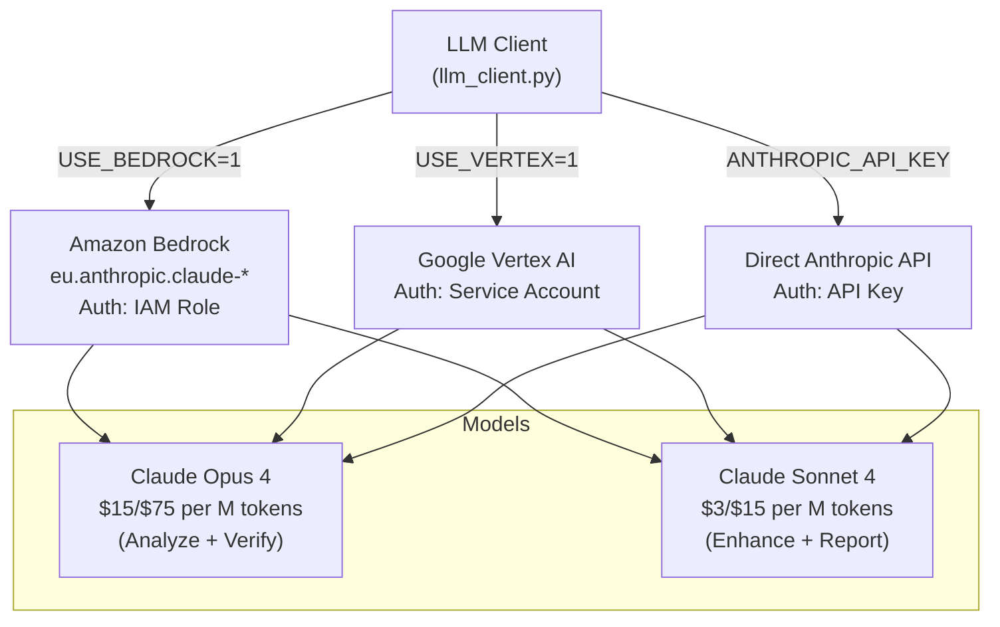

---

## 15. Core Class Diagram

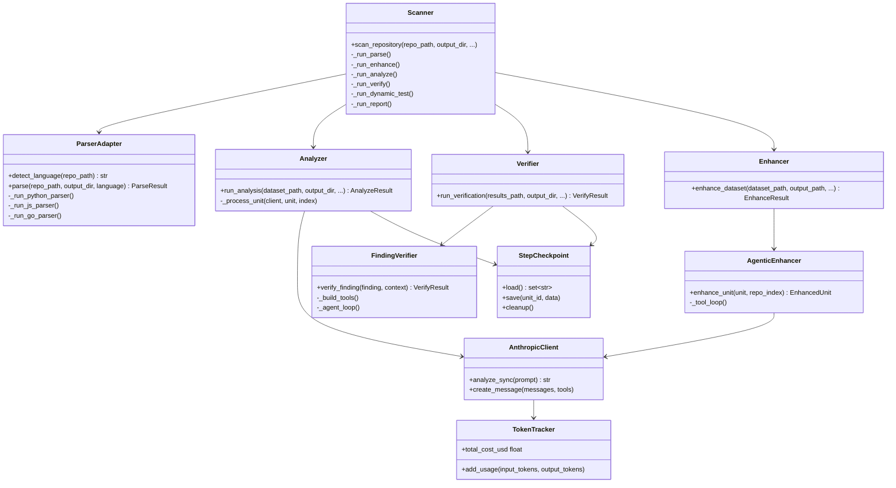

---

## 16. Processing Levels (Cost Optimization)

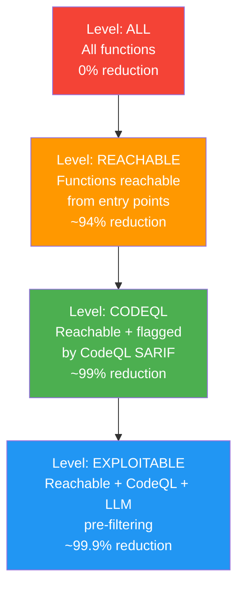

---

## 17. Go CLI ↔ Python Core Interaction

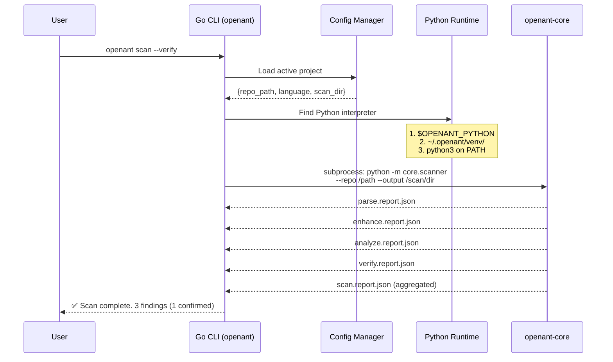

---

## 18. Output Files Summary

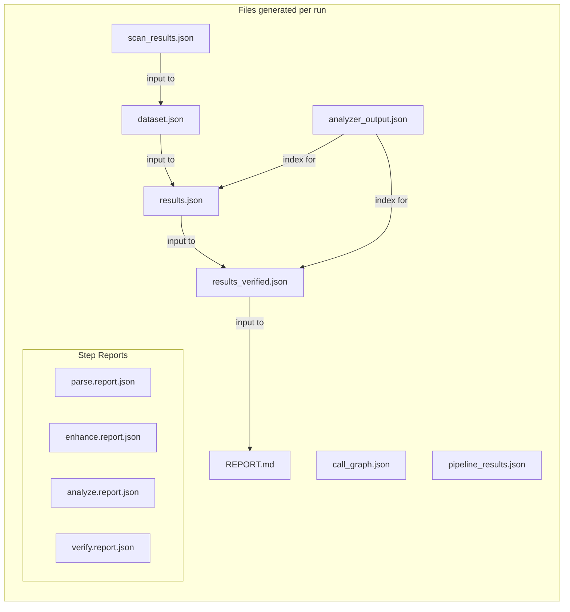

---

## 19. Security & Quality Controls

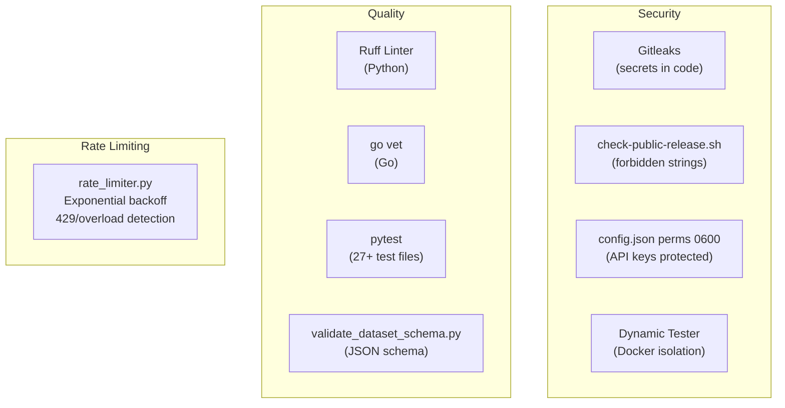

---

## 20. Dynamic Testing Flow

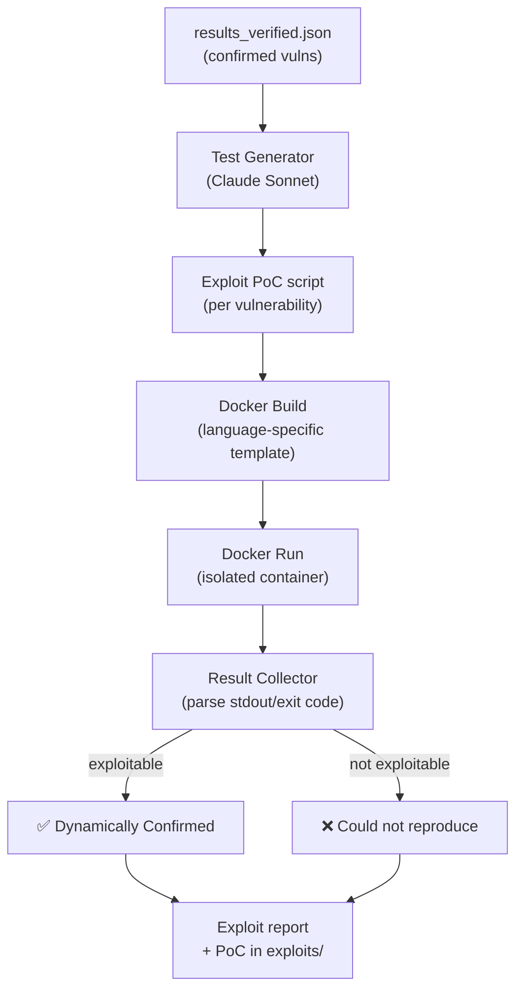

---

## 21. Typical User Journey

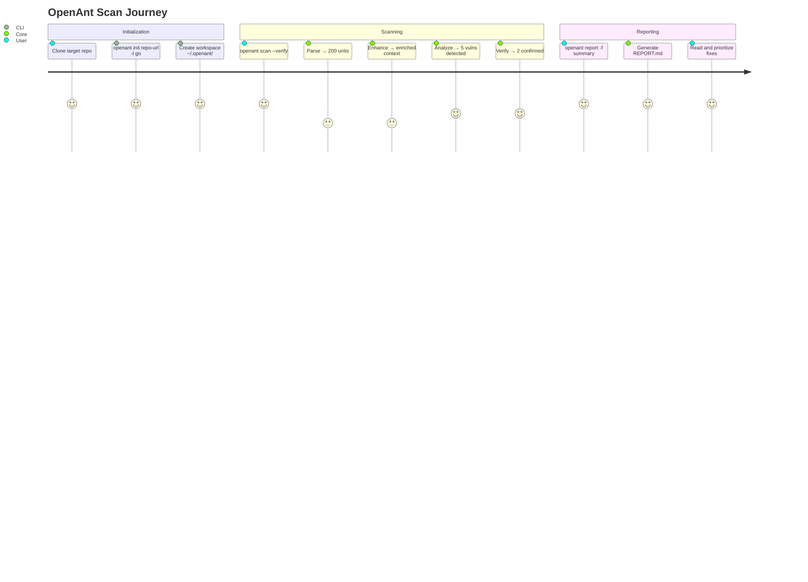

---

## Summary Table

| Component | Technology | Role |
|-----------|-----------|------|
| CLI | Go 1.25+ (Cobra) | User interface, project management |
| Core | Python 3.11+ | Pipeline orchestration, business logic |
| Parsers | Python + Node.js + Go | Multi-language AST extraction |
| LLM | Claude Opus/Sonnet (Anthropic) | Detection and verification |
| Infra | AWS ECS Fargate + S3 + Bedrock | Scalable execution |
| CI/CD | GitHub Actions | Multi-OS tests + lint + secrets |
| Isolation | Docker | Dynamic exploit testing |

**Key Architecture Strengths**:
- Resumable pipeline via per-step checkpoints
- Multi-backend LLM support (Bedrock, Vertex AI, direct API)
- Cost optimization via processing levels (-94% to -99.9%)
- Two-stage approach eliminates contextual false positives
- Extensible multi-language support via Parser Adapter pattern
